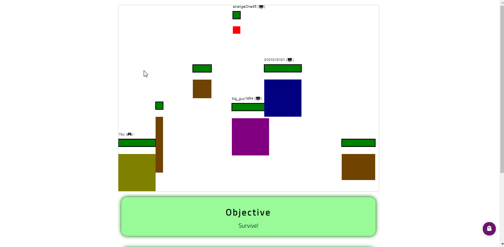

# Purpose
- A basic shooting/survival game where you play against other computer/AI players.
- Your objective is to survive by shooting other players and become the last player standing.

  
# How to run
- Install Node.js (if not already installed)
- Clone this repo
- `cd` into `typescript-game` directory and then `npm i`
- `npm run wp` to build the game locally
- Use something like [Liveserver](https://marketplace.visualstudio.com/items?itemName=ritwickdey.LiveServer) to serve the built `index.html` (and other files) locally (see: `./dist/` folder).

# Other commands
- `npm run wpw` to start "watch" mode, which can then trigger builds automatically when files are changed and saved.

# Tools used
- Core application
  - TypeScript (vanilla)
  - Canvas API
  - `requestAnimationFrame` browser API
  - HTML, CSS (vanilla)
- Bundling
  - Webpack

# What I learned
- Learned TypeScript. This was my first project/application built using it.
- Learned the concept of generics and the type reusability benefits generics provide in TypeScript (as well as other languages which offer generics).
- ES6 class syntax.
- Favouring composition over inheritance allows us to avoid introducing rigid, deep inheritance hierarchies that can quickly become difficult to maintain.
- Designing objects and interfaces that are in line with OOP practices and SOLID principles.
- Learned how to set up and configure a build workflow (using webpack and TS loader) where the TypeScript files are compiled and then bundled into a single, minified JavaScript file.
- Learned how to efficiently render a representation of game data to a canvas element via the `requestAnimationFrame` browser API. This approach can be preferable (especially on smaller devices) as it prevents unnecessary renders in the event that another browser tab is active (and the game is not currently visible to the user).
- Learned how to build a game without a game/physics library and creating my own game loop.
- Learned how to implement things like collision detection from scratch and the underlying maths/geometry involved.

# Things to add
- Better looking players sprites (instead of just coloured rectangles).
- Better looking background/environment (instead of just a plain white canvas).
- A game menu that allows you to:
  - Pause the game
  - Restart the game

# Created
- Oct 2020
